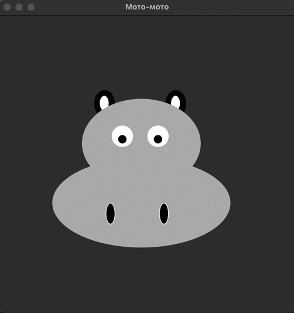

# Практическая работа №18 #
### Тема: Составление программ с использованием анимации ###
### Цель: Совершенствование навыков составления программ на основе графики ###
#### Вариант №12 ####
#### Задача: ####

> Написать программу, котороя вычерчивает на экране бегемота
##### Контрольный пример: #####

>Получаю: 


##### Системный анализ: #####

>Входные данные: `None`
>Промежуточные данные: `root`, `canvas`  
>Выходные данные: `canvas`  


##### Блок схема: #####


##### Код программы: #####

```python
from tkinter import *
from tkinter import messagebox

# Функция для перемещения бегемота
def move(event):
    # Определяем движение в зависимости от нажатой клавиши
    if event.keysym == 'w':
        canvas.move("hippo", 0, -10)  # Вверх
    elif event.keysym == 's':
        canvas.move("hippo", 0, 10)   # Вниз
    elif event.keysym == 'a':
        canvas.move("hippo", -10, 0)  # Влево
    elif event.keysym == 'd':
        canvas.move("hippo", 10, 0)   # Вправо
    else:
        messagebox.showinfo("Ошибка!", "Нажмите одну из предложенных клавиш: W, A, S, D")

root = Tk()
root.title("Мото-мото")
root.geometry("500x500")

canvas = Canvas(root, height=500, width=500)
canvas.pack()

# Рисуем бегемота (все части объединены с тегом "hippo")
# Уши
canvas.create_oval(170, 180, 205, 135, fill='black', outline='', tags="hippo")
canvas.create_oval(290, 180, 325, 135, fill='black', outline='', tags="hippo")

# Дыры в ушах
canvas.create_oval(180, 170, 195, 145, fill='white', outline='', tags="hippo")
canvas.create_oval(300, 170, 315, 145, fill='white', outline='', tags="hippo")

# Тело
canvas.create_oval(100, 250, 400, 400, fill='grey70', outline='', tags="hippo")
canvas.create_oval(150, 150, 350, 300, fill='grey70', outline='', tags="hippo")

# Глаза
canvas.create_oval(200, 230, 235, 195, fill='white', tags="hippo")
canvas.create_oval(260, 230, 295, 195, fill='white', tags="hippo")

# Зрачки
canvas.create_oval(210, 225, 225, 210, fill='black', tags="hippo")
canvas.create_oval(270, 225, 285, 210, fill='black', tags="hippo")

# Ноздри
canvas.create_oval(190, 360, 205, 325, fill='black', tags="hippo")
canvas.create_oval(280, 360, 295, 325, fill='black', tags="hippo")

# Привязываем обработку событий клавиатуры к окну
root.bind('<Key>', move)

root.mainloop()

```

##### Результат работы программы: #####
> Оконное:


##### Контрольные вопросы: #####

1. Методы работы с анимацей:  
move() - метод для работы с анимацией  


2. Операции для работы с анимацией:  
move() - метод для работы с анимацией  
3. Примеры работы с анимацией:
Примером является данная практика.
##### Вывод по проделанной работе: #####
> Я совершенствовал навыки составления программ c использовнием анимации, анимировав неповторимого бегемотика.