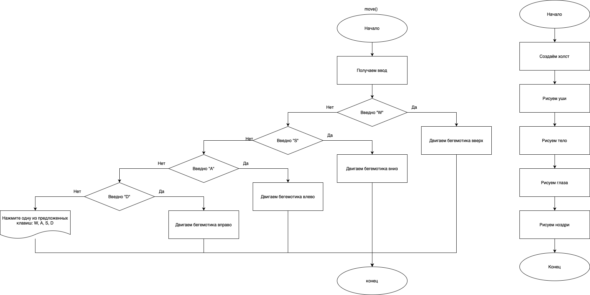

# Практическая работа №17 #
### Тема: Составление программ с использованием графики ###
### Цель: Совершенствование навыков составления программ на основе графики ###
#### Вариант №12 ####
#### Задача: ####

> Написать программу, котороя вычерчивает на экране бегемота
##### Контрольный пример: #####

>Получаю: 


##### Системный анализ: #####

>Входные данные: `None`
>Промежуточные данные: `root`, `canvas`  
>Выходные данные: `canvas`  


##### Блок схема: #####



##### Код программы: #####

```python
from tkinter import *
root = Tk()
root.title("Мото-мото")
root.geometry("500x500")


canvas = Canvas(root, height=500, width=500)
# делаем холст видимым
canvas.pack()

canvas.create_oval(170, 180, 205, 135, fill='black', outline='') # Уши
canvas.create_oval(290, 180, 325, 135, fill='black', outline='')


canvas.create_oval(180, 170, 195, 145, fill='white', outline='') # Дыры в ушах
canvas.create_oval(300, 170, 315, 145, fill='white', outline='')


canvas.create_oval(100, 250, 400, 400, fill='grey70', outline='') # Тело
canvas.create_oval(150, 150, 350, 300, fill='grey70', outline='')


canvas.create_oval(200, 230, 235, 195, fill='white') # Глаза
canvas.create_oval(260, 230, 295, 195, fill='white')


canvas.create_oval(210, 225, 225, 210, fill='black') # Зрачки
canvas.create_oval(270, 225, 285, 210, fill='black')

canvas.create_oval(190, 360, 205, 325, fill='black') # Ноздри
canvas.create_oval(280, 360, 295, 325, fill='black')


root.mainloop()
```

##### Результат работы программы: #####
> Оконное:


##### Контрольные вопросы: #####

1. Методы работы с графикой:
canvas() - холст для рисования
create_oval() - рисование эллипсов или окружностей
create_line() - рисование линий
create_rectangle() - рисование прямоугольников
create_text() - рисование текста
pack() - позволчем упаковать холст в окно


2. Операции для работы с графикой:
move() - перемещение объектов
delete() - удаление элементов
3. Примеры работы с графикой:
Примером является данная практика.
##### Вывод по проделанной работе: #####
> Я совершенствовал навыки составления программ c использовнием графики, нарисовав неповторимого бегемотика.